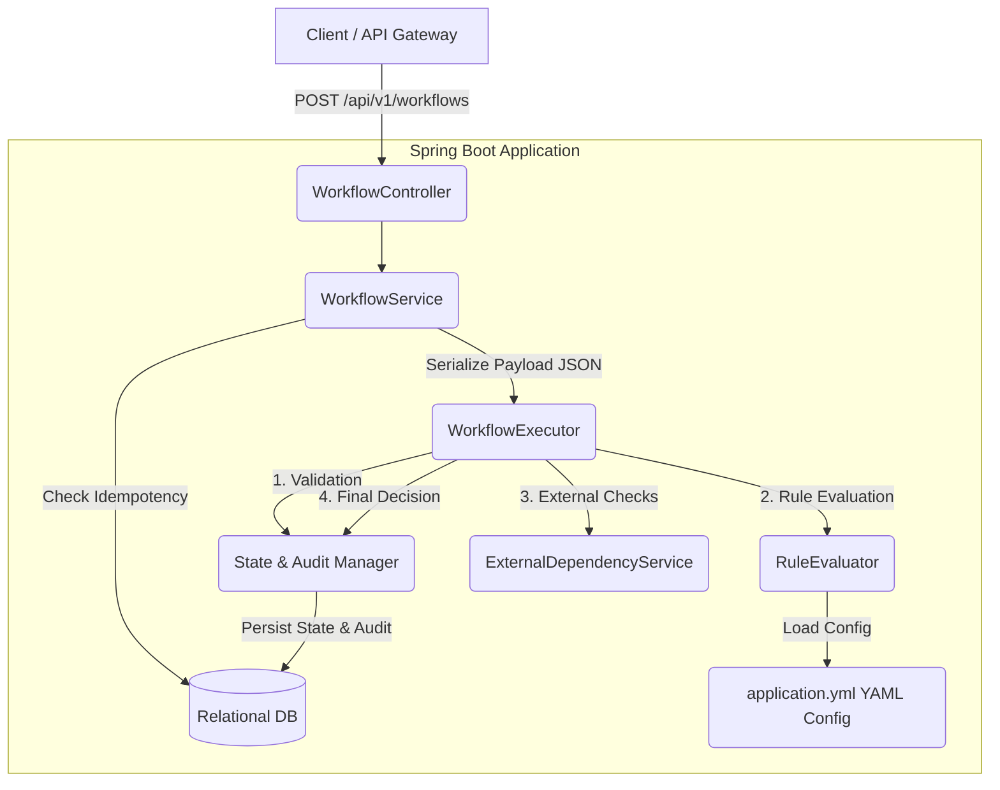

# Workflow Decision Platform Architecture

## System Overview
The Configurable Workflow Decision Platform is designed to process complex, multi-stage business workflows (e.g., Application approvals, Claim processing, Onboarding) without requiring code deployments for rule or threshold changes. It achieves this by externalizing business logic into declarative configurations while providing robust state management, idempotency, and full auditability internally.

The system is built on **Java 17** and **Spring Boot 3.2**, leveraging an embedded **H2** database for zero-setup execution (easily hot-swappable to PostgreSQL or similar for production).

## High-Level Architecture Component Diagram

## Core Components

1. **WorkflowController (API Interface)**
   - Exposes RESTful endpoints for workflow intake and status queries.
   - Handles global exception mapping.

2. **WorkflowService (Orchestrator)**
   - Manages the transactional boundaries for request intake.
   - Enforces **Idempotency** via unique keys (checks the `idempotencyKey` against the database to prevent duplicate execution).
   - Defers asynchronous workflow processing to the `WorkflowExecutor`.

3. **WorkflowExecutor (Stage Machine)**
   - Implements the stage pipeline: `PENDING` -> `VALIDATION` -> `RULE_EVALUATION` -> `EXTERNAL_CHECK` -> `DECISION`.
   - Handles localized failure and retry mechanics (e.g. if the external service fails, the workflow waits in `RETRYING` without re-running passed rules).

4. **RuleEvaluator (Business Logic)**
   - Parses the JSON intake payload and evaluates it against rules loaded dynamically from the Spring Configuration (`WorkflowProperties`).
   - Implements a short-circuit fail strategy: If a rule marked as `REJECT` fails, subsequent rules are skipped to preserve system resources and mimic real-world credit bureau logic.

5. **AuditService & State Management**
   - Implements an append-only audit trail.
   - Captures input, triggered rules, and explanation data for every state transition to ensure explainability.

6. **ExternalDependencyService**
   - Simulates integrations with 3rd-party providers (e.g. Identity verification, Credit check). Injected with configurable failure rates to test system resiliency.

## Data Flow & Lifecycle

1. **Intake**: A JSON payload arrives containing an `idempotencyKey` and `workflowType`.
2. **Persistence**: The request is inserted into the DB as `PENDING`. If the `idempotencyKey` uniquely violates a DB constraint, an HTTP 409 is returned immediately with the existing result.
3. **Execution**: The executor moves the state to `VALIDATION`, generating an audit log.
4. **Evaluation**: The payload is flattened and compared against the dynamically loaded YAML rules. Each rule generates a `RuleEvaluationResult`. Features derived dynamically (like Loan-to-Income ratio) are calculated. 
5. **External Systems**: The external mock is called. If it fails, the workflow is saved as `RETRYING` and is queued for future retries.
6. **Decision**: Synthesizes the results. Determines whether the outcome is `APPROVED`, `REJECTED`, or `MANUAL_REVIEW`.
7. **Audit**: All findings, including the precise reason for failure (e.g. "Credit score 580 < 650"), are bundled and attached to the final workflow response.

## Trade-offs and Design Decisions

| Decision | Rationale | Drawback |
|----------|-----------|----------|
| **YAML Rule Configuration over Database rules** | Accelerates local development and integrates cleanly with CI/CD GitOps practices. No code required to change a threshold. | Harder to build an interactive admin UI for rule generation compared to a pure DB-driven rule store. |
| **Sync DB Idempotency Constraint** | Relies on the database's ACID properties (UNIQUE constraint) to handle concurrent duplicate requests, which is 100% reliable and requires no additional infrastructure. | Under extremely high parallel load, requires DB vertical scaling instead of cheap Redis distributed locks. |
| **Single Payload JSON Object** | Different workflows require drastically different data schemas. Using a massive JSON `payload` object offers infinite flexibility. | Losing strict schema compilation checks at compile time. Validation is deferred to the RuleEvaluator runtime. |
| **Short-Circuiting Failures** | If a critical rule (e.g. "Is over 18?") fails, we halt further evaluation. Mimics real-world cost-saving implementations for expensive API checks. | Does not provide the user with a comprehensive list of *every single* failing reason if the first rule fails. |

## Scaling Considerations

To evolve this Hackathon implementation into an enterprise-grade high-throughput distributed system, the following architectural upgrades are recommended:

1. **Execution Queueing (Kafka / SQS)**
   - *Current*: Local `@Async` thread pool.
   - *Future*: The `WorkflowService` produces a start message to Kafka. Workers consume and process states, distributing load seamlessly.

2. **Distributed Locking for Idempotency (Redis)**
   - *Current*: Database unique constraints.
   - *Future*: Use Redis to handle TTL-based idempotency locks before generating heavy DB queries, reducing hit-rate on the primary store.

3. **External Event Sourcing (Audit)**
   - *Current*: Append-only logs on a relational DB table.
   - *Future*: Stream all state transitions to a log-centric platform like Datadog, Splunk, or ElasticSearch for analytics.

4. **Retry Resiliency (Spring Retry / Temporal.io)**
   - *Current*: Thread sleep and loop.
   - *Future*: Rely on exponential backoff and dead-letter queues (DLQ) natively or use a framework like Temporal/Cadence for true durable execution.
